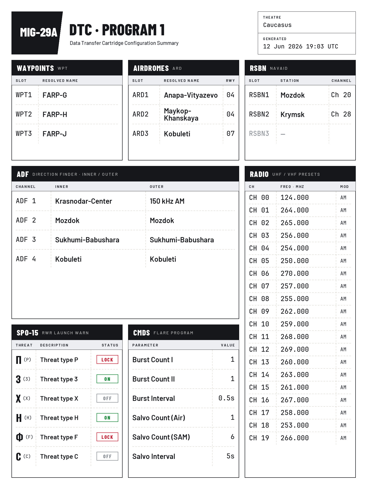

# DCS MiG-29A DTC Kneeboard Utility

Auto-generates a kneeboard page summarising your MiG-29A's Data Transfer
Cartridge (DTC) every time you spawn into the jet in DCS World. No more
screenshotting the mission planner: the moment you occupy a MiG-29A slot, the
utility reads the DTC you loaded and renders it as a clean, readable kneeboard
page in the in-game kneeboard.

<p align="center">
  
  <br>
  <em>An auto-generated kneeboard page for a loaded DTC.</em>
</p>

## What it shows

A single 1536x2048 kneeboard page with the contents of your loaded DTC,
including navigation/tactical points, radio-navigation channels, ADF
beacons (resolved to station names for the current map, each shown with its
frequency for cross-checking) and SPO-15 launch warning settings.

## How it works

The utility has two small parts:

1. **A DCS hook** (installed automatically into
   `Saved Games\DCS\Scripts\Hooks\`) detects when you spawn into a MiG-29 and
   writes a tiny trigger file. That is all it does.
2. **A companion Windows app** (system-tray, customtkinter GUI) watches for the
   trigger, extracts the DTC data from DCS's temp files, resolves beacon names
   from the map's `beacons.lua`, renders the kneeboard JPG and saves it to
   `Saved Games\Kneeboard\MiG-29 Fulcrum\000_dtc_config.jpg`. It plays a short
   confirmation sound on each new render, so you get audible feedback in VR.

DCS picks up the refreshed page on your next spawn. Nothing is injected into
the mission and no game files are modified; the hook uses DCS's official
`Scripts/Hooks` mechanism, the same one used by SRS, Tacview and OpenKneeboard.

## Installation

1. Download `DCS_DTC_Kneeboard.exe` from the
   [latest release](../../releases/latest).
2. Put it in any user-writable folder (not `C:\Program Files`) and run it.
   `config.json` and a log file are written next to the exe.
3. On first run the app auto-detects your DCS install, Saved Games and temp
   paths (and prompts for anything it cannot find), then installs/updates the
   hook.
4. Start DCS, jump into a MiG-29A with a DTC loaded, and check your kneeboard
   on the next spawn.

> **SmartScreen / antivirus note:** the exe is an unsigned PyInstaller
> single-file build, which Windows sometimes flags. Build it yourself from
> source (below) or check the release's CI build provenance if in doubt.

### Running from source

```
cd App
python -m venv .venv && .venv\Scripts\activate
pip install -r requirements.txt
python main.py
```

Requires Python 3.11+ on Windows. See [App/BUILD.md](App/BUILD.md) to build
the exe yourself; releases are built automatically by
[GitHub Actions](.github/workflows/build.yml).

## Compatibility

- Windows 10/11, DCS World standalone (registry/path auto-detection; Steam
  installs can be configured manually in the app).
- The Eagle Dynamics MiG-29A Fulcrum module.
- Tested against DCS 2.9.x. DCS updates that change the DTC temp-file format
  may break extraction until the parser is updated.

## Development

- Authoritative design: [docs/technical-spec.md](docs/technical-spec.md)
- DTC format notes: [docs/dtc-format-reference.md](docs/dtc-format-reference.md)
- beacons.lua parsing write-up:
  [docs/beacon-parser-findings.md](docs/beacon-parser-findings.md)
- Tests live in `App/test files/` (plain Python scripts, no pytest needed).
  Fixtures that contain DCS-owned content (real `beacons.lua` files, DTC
  captures) are not distributed; the relevant checks skip cleanly when the
  fixtures are absent. Set `DCS_BEACONS_DIR` or populate
  `App/test files/fixtures/` to enable them locally.

Adaptations for other aircraft are welcome: the spawn detection, DTC
extraction and rendering layers are deliberately separated, so an F-16 or
F/A-18 variant mostly means a new processor/renderer pair.

## Licence and credits

- Licensed under the [GNU GPL v3.0](LICENSE).
- Bundled fonts (Barlow, Barlow Condensed, JetBrains Mono, Oswald) are used
  under the SIL Open Font License 1.1; see the `OFL-*.txt` files in
  [App/fonts/](App/fonts/).
- Kneeboard visual language inspired by "Aerodrome Data and Frequencies" by
  DimOn (Dima Kozyrev).
- Not affiliated with or endorsed by Eagle Dynamics. DCS World is a trademark
  of Eagle Dynamics SA.
